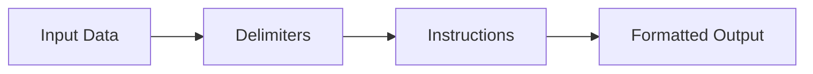

Here's the styled version of the new text:

# 🎯 Anthropic's Prompt Engineering Masterclass
> *Your comprehensive guide to crafting perfect prompts for Claude*

[](https://anthropic.com)
[](https://anthropic.com)

---

### 🎓 What's This About?
A lean, practical guide to mastering prompt engineering with Claude. Perfect for both beginners and advanced users looking to level up their AI interaction skills!

---

## 🌟 Core Concepts & Maximization Strategies

### 📝 Basic Foundations
```python
# Basic Prompt Structure
instruction = "Summarize this article about AI"
context = "Be clear and specific"
```
- **Chapter 1:** Basic Prompt Structure
- **Chapter 2:** Clarity and Directness
- **Pro Tip:** Always start with explicit instructions

### 🎭 Role-Based Engineering
| Role | Use Case | Effectiveness |
|------|----------|--------------|
| Teacher | Educational | ⭐⭐⭐⭐⭐ |
| Journalist | Reporting | ⭐⭐⭐⭐ |
| Analyst | Data Review | ⭐⭐⭐⭐ |

### 🔍 Data Organization


### 🎨 Output Styling
> Shape Claude's voice and format with precision!
```python
# Format control example
output_format = {
    "style": "formal",
    "format": "JSON",
    "tone": "professional"
}
```

---

## 🧠 Advanced Techniques

### Step-by-Step Thinking Process
- [ ] Break down complex problems
- [ ] Use explicit reasoning
- [ ] Validate each step
- [ ] Cross-reference information

### 📚 Example-Driven Learning
```python
# Example framework
input_example = "Sample input"
desired_output = "Expected result"
context = "Explanation of transformation"
```

---

## 🚀 Pro-Level Strategies

1. **Hallucination Prevention** → Ground with facts
2. **Complex Workflows** → Chain prompts
3. **Tool Integration** → Expand capabilities
4. **Multi-Step Processing** → Break down tasks

---

## 🔗 Essential Resources
- [📘 Full Tutorial](https://anthropic.com/claude/tutorial)
- [🎥 Practice Exercises](https://anthropic.com/claude/exercises)
- [💬 Community Forum](https://anthropic.com/community)

---

> 💫 *"Better prompts, better results!"*

---

*Created with 🤖 by Anthropic for prompt engineers everywhere*

[⭐ Access Tutorial](https://anthropic.com/tutorial) | [🔧 Practice Now](https://anthropic.com/practice)
