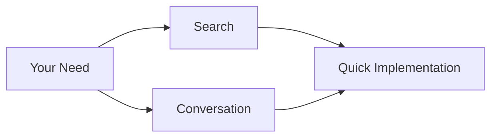

Here's a more visually engaging version styled for a Marimo notebook:

# 🚀 Generative AI on Google Cloud: Developer's Playground
> *Your friendly guide to building amazing things with Google Cloud's AI capabilities* 

[](https://marimo.io)
[](https://cloud.google.com/vertex-ai)

---

### 🎯 What's This All About?
An unofficial but awesome collection of tools, samples, and notebooks for exploring Generative AI on Google Cloud. Think of it as your experimental lab for building cool stuff! 

---

## 🌟 Key Areas to Explore

### 🤖 Gemini (The New Hotness!)
```python
# The future is here
gemini = vertex_ai.get_model("gemini-pro")
```
- **What's Inside:** Latest Gemini 2.0 Flash notebooks & demos
- **Cool Features:** Multimodal capabilities, marketing tools, research agents
- **Pro Tip:** Start with intro notebooks before diving into the fancy stuff

### 🧱 Building Blocks
| Model | Use Case | Power Level |
|-------|-----------|------------|
| PaLM  | Language  | 🔥🔥🔥    |
| Imagen| Vision    | 🔥🔥🔥    |
| Chirp | Audio     | 🔥🔥      |

### 🔍 Pre-Built Solutions


### 📚 RAG (Retrieval Augmented Generation)
> Connect AI with your data like a pro!
```python
# Example RAG flow
documents = load_your_data()
embeddings = create_embeddings(documents)
response = generate_with_context(query, embeddings)
```

---

## 🛠️ Getting Started

### Essential Setup Checklist
- [ ] Configure Google Cloud environment
- [ ] Install required SDKs
- [ ] Set up authentication
- [ ] Test your connection

```bash
# Quick setup (example)
pip install google-cloud-aiplatform
export GOOGLE_APPLICATION_CREDENTIALS="path/to/credentials.json"
```

---

## 💡 Pro Tips for Success

1. **Start Small** → Begin with intro notebooks
2. **Experiment** → Code is meant to be played with
3. **Stay Current** → Check updates regularly
4. **Connect** → Explore related repos
5. **Document** → Keep notes of your discoveries

---

## 🔗 Quick Links
- [📘 Documentation](https://cloud.google.com/vertex-ai/docs)
- [🎥 Tutorial Videos](https://www.youtube.com/googlecloud)
- [💬 Community Support](https://stackoverflow.com/questions/tagged/google-cloud-platform)

---

> 💫 *"The best way to predict the future is to create it!"*

---

*Made with ❤️ by developers, for developers*

[⭐ Star this repo](https://github.com/GoogleCloudPlatform/generative-ai) | [🐛 Report issues](https://github.com/GoogleCloudPlatform/generative-ai/issues)


<new>
## Prompt:
Recreate a Detailed Workflow Prompt

"I want you to provide a complete and detailed workflow for [learn to using a docker , pushing it to ecr then to app runner  ]. Include clear instructions, reasoning for each step, and scripts where applicable. Your response should be broken down into the following structured sections:

1. Overview: Summarize the project or task, explaining the goals and how everything connects.


2. Workflows:

Provide a step-by-step breakdown of the process.

Use frameworks like CRC (Component Responsibility Collaboration) to identify components, responsibilities, and their interactions.

Include CIDC (Continuous Integration and Continuous Deployment) pipelines where relevant.


3. Scripts and Commands:

Provide complete scripts in languages like Python, SQL, or shell where needed.

Include detailed comments explaining each part of the code.

Ensure the scripts are ready to copy and run without modification.


4. Manual and CLI Instructions:

Explain how to perform tasks both using a graphical interface (console) and programmatically (CLI).


5. Automation:

Include instructions for automating workflows with tools like AWS Lambda, cron jobs, or CI/CD pipelines.

Add reasoning on when and why automation is necessary.


6. Visualizations:

Provide steps to create meaningful visualizations using tools like Grafana, QuickSight, or similar.

Suggest dashboards or charts that would show insights effectively.


7. Project Management:

Recommend tools (like Asana, Trello, Notion) to manage the project.

Outline a task-tracking approach for clear progress visibility.


8. Documentation:

Create a sample README.md file to summarize the project, steps, and scripts.


9. Reasoning:

For each tool, command, or method, explain why it’s being used and how it contributes to the bigger picture.


10. Deliverables:

Organize everything into a clear project folder structure, where scripts, documentation, and visualizations are well categorized.


Make the response clear, detailed, and actionable so that someone can follow it step-by-step to recreate the entire workflow."


---

Why This Prompt Works

1. Clarity: Each section is clearly defined.


2. Comprehensive Output: Forces the LLM to generate scripts, instructions, reasoning, and deliverables.


3. Modularity: Makes it reusable for any topic (e.g., AWS Athena workflows, ETL pipelines, Kubernetes setups).


4. High Utility: Encourages actionable, ready-to-run solutions.


By replacing "[insert your topic here]" with any task or idea, you'll get a detailed workflow and scripts similar to the one I provided earlier!

## Response:
### Detailed Workflow: Learn to Use Docker, Push to ECR, and Deploy to App Runner

* * *

### 1\. **Overview**

This project guides you through building, containerizing, and deploying an application using Docker, AWS Elastic Container Registry (ECR), and AWS App Runner. The primary goal is to enable seamless deployment of containerized applications in the cloud.

**How Everything Connects:**

*   **Docker**: Used to containerize the application for consistent runtime environments.
*   **ECR**: Stores the Docker images securely in AWS.
*   **App Runner**: Deploys and runs the application directly from ECR with minimal configuration.

* * *

### 2\. **Workflows**

#### Step 1: **Set up Docker locally**

*   Install Docker.
*   Write a `Dockerfile` to define the container.

#### Step 2: **Create an AWS ECR Repository**

*   Use the AWS Management Console or CLI to create an ECR repository.

#### Step 3: **Push the Docker image to ECR**

*   Authenticate Docker with AWS ECR.
*   Build and tag the Docker image.
*   Push the image to the ECR repository.

#### Step 4: **Set up AWS App Runner**

*   Use AWS App Runner to create a service connected to your ECR repository.
*   Configure deployment settings and runtime environment variables.

#### Step 5: **Test and monitor the deployment**

*   Access the deployed application via the App Runner URL.
*   Monitor logs and health metrics through the AWS console or CloudWatch.

* * *

### 3\. **Scripts and Commands**

#### **Dockerfile**

```dockerfile
# Use a lightweight base image
FROM python:3.9-slim

# Set the working directory
WORKDIR /app

# Copy application code
COPY . /app

# Install dependencies
RUN pip install -r requirements.txt

# Expose the port the app runs on
EXPOSE 8080

# Command to run the app
CMD ["python", "app.py"]
```

#### **Shell Commands**

```bash
# Step 1: Install Docker
sudo apt-get update && sudo apt-get install -y docker.io

# Step 2: Authenticate Docker with AWS
aws ecr get-login-password --region <region> | docker login --username AWS --password-stdin <account_id>.dkr.ecr.<region>.amazonaws.com

# Step 3: Build and Tag the Docker Image
docker build -t my-app .

# Step 4: Tag the image for ECR
docker tag my-app:latest <account_id>.dkr.ecr.<region>.amazonaws.com/my-app:latest

# Step 5: Push the image to ECR
docker push <account_id>.dkr.ecr.<region>.amazonaws.com/my-app:latest
```

* * *

### 4\. **Manual and CLI Instructions**

#### AWS Console:

1.  **ECR**:
    *   Navigate to ECR in the AWS Management Console.
    *   Create a new repository and note the URI.
2.  **App Runner**:
    *   Navigate to App Runner.
    *   Create a new service using the ECR repository.
    *   Configure runtime and environment variables as needed.

#### CLI:

```bash
# Create an ECR repository
aws ecr create-repository --repository-name my-app

# Deploy with App Runner using CLI (requires App Runner JSON config)
aws apprunner create-service --service-name my-app-service --source-configuration file://apprunner-config.json
```

* * *

### 5\. **Automation**

#### **CI/CD Pipeline with GitHub Actions**

```yaml
name: Deploy to AWS App Runner

on:
  push:
    branches:
      - main

jobs:
  build-and-deploy:
    runs-on: ubuntu-latest

    steps:
    - name: Checkout Code
      uses: actions/checkout@v3

    - name: Log in to AWS ECR
      run: |
        aws ecr get-login-password --region <region> | docker login --username AWS --password-stdin <account_id>.dkr.ecr.<region>.amazonaws.com

    - name: Build and Push Docker Image
      run: |
        docker build -t my-app .
        docker tag my-app:latest <account_id>.dkr.ecr.<region>.amazonaws.com/my-app:latest
        docker push <account_id>.dkr.ecr.<region>.amazonaws.com/my-app:latest

    - name: Deploy to App Runner
      run: |
        aws apprunner create-service --service-name my-app-service --source-configuration file://apprunner-config.json
```

* * *

### 6\. **Visualizations**

#### **Monitoring Logs and Metrics**

*   Use **AWS CloudWatch** to track application performance.
*   Integrate **Grafana** with AWS for custom dashboards.

#### Example Metrics:

*   **Deployment success rate**: Track number of successful deployments.
*   **Application health**: Monitor response times and error rates.

* * *

### 7\. **Project Management**

*   Use **Trello** for task tracking with the following boards:
    *   **To Do**: Set up Docker, write Dockerfile.
    *   **In Progress**: Create ECR repository, push image.
    *   **Done**: Deploy App Runner service, test application.
*   Use **Notion** for documenting deployment steps.

* * *

### 8\. **Documentation**

#### README.md

```markdown
# Docker to AWS App Runner Workflow

## Overview
This project demonstrates deploying a Dockerized application to AWS App Runner via ECR.

## Steps
1. Write a `Dockerfile`.
2. Create an ECR repository and push the image.
3. Deploy the application using AWS App Runner.

## Scripts
- Dockerfile and shell commands provided in the `/scripts` folder.

## Monitoring
Use CloudWatch or Grafana for logs and metrics.
```

* * *

### 9\. **Reasoning**

*   **Docker** ensures a consistent runtime across environments.
*   **ECR** provides secure image storage integrated with AWS services.
*   **App Runner** simplifies deployment by removing the need for managing infrastructure.

* * *

### 10\. **Deliverables**

#### Project Folder Structure

```arduino
project/
├── app/
│   ├── app.py
│   ├── requirements.txt
├── docker/
│   ├── Dockerfile
├── scripts/
│   ├── deploy.sh
│   ├── apprunner-config.json
├── README.md
```

* * *

This workflow provides a clear, actionable guide for Docker-to-App Runner deployment, emphasizing both manual and automated solutions.


