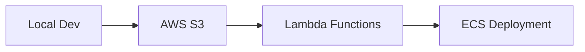

# 🎯 Strategic Technology Integration Plan
> *Optimizing workflows and maximizing impact through strategic technology integration.*


---

### 🎓 Core Infrastructure

#### 🏗️ Local Development Environment
```python
# Example: GPU utilization script
import tensorflow as tf
print("Num GPUs Available: ", len(tf.config.list_physical_devices('GPU')))
```
- **Component 1:** NVIDIA 4060 GPU utilization
- **Component 2:** Robust IDEs (VS Code, JetBrains)
- **Component 3:** Comprehensive local testing

#### 🤖 AI Assistants & Automation
| Assistant | Task | Benefit |
|---|---|---|
| Claude | Folder management, Logging | Enhanced organization |
| OpenAI | File operations, Code generation | Increased productivity |
| Custom Workflows | Automation | Streamlined processes |


#### ☁️ Cloud Infrastructure


#### 💻 Interactive Development
> Empowering real-time exploration and analysis.
```python
# Example: Marimo cell
import matplotlib.pyplot as plt
plt.plot([1, 2, 3, 4])
plt.ylabel('some numbers')
plt.show()
```

#### ⛓️ Web3 & Blockchain
- **Framework 1:** Solidity & Hardhat/Foundry
- **Service 1:** Thirdweb Deployment
- **Focus:** Secure and scalable blockchain frameworks

#### 📢 Community & Distribution
- **Platform 1:** GitHub (Public & Private)
- **Platform 2:** Hugging Face Model Sharing
- **Platform 3:** Medium & Content Distribution


---

## 🌟 Optimization Workflow

### 1️⃣ Ideation → Local Testing
- [ ] Rapid prototyping with AI assistance
- [ ] GPU-accelerated iterative testing
- [ ] Early version control


### 2️⃣ Cloud Integration
- [ ] Strategic AWS service selection
- [ ] Scalability and performance testing
- [ ] Resource optimization


### 3️⃣ Documentation & Sharing
- [ ] Automated documentation (mkdocs/Sphinx)
- [ ] Community engagement (GitHub/Discord)
- [ ] Regular updates and guides


---

## 🚀 Tactical Implementation Plan

### 1️⃣ Project Setup and Reusability
- **Tool 1:** Docker Containers
- **Tool 2:** Reusable Marimo Notebooks
- **Practice:** Clear folder structures, modular code


### 2️⃣ AI Workflow Deployment
- **API:** ChatRTX for LLM integration and RAG
- **Library:** TensorRT-LLM for GPU acceleration
- **Tool:** Whisper (voice) & LlamaIndex (data querying)


### 3️⃣ Data-Driven Decision Making
- **Database:** DynamoDB (real-time) & Redshift (batch)
- **Dashboard:** Retool/Grafana
- **Storage:** AWS S3 with lifecycle policies


### 4️⃣ End-to-End Monitoring and Maintenance
- **Monitoring:** CloudWatch
- **Automation:** CI/CD Pipelines
- **Security:** Periodic audits


---

## 💡 Reusable Prompt for New Ideas
> Generating innovative solutions aligned with existing capabilities.

```python
# Prompt Template
domain = "Web3"
tools = ["Hardhat", "Thirdweb"]
metric = "reducing time-to-deploy"
area = "interactive development"
benefit = "cost reduction"

prompt = f"""Imagine enhancing our workflows in {domain}. Considering our current tools like {tools}, propose innovative solutions or integrations that can:
1. Improve efficiency by {metric}.
2. Expand our capabilities in {area}.
3. Provide measurable benefits in terms of {benefit}.

Generate actionable steps to implement these ideas."""

print(prompt)
```


---

*Continuously evolving and optimizing workflows through strategic technology integration.*

